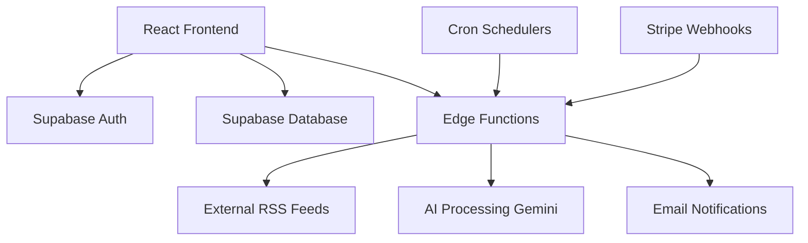

# FlowSense

**A modern, intelligent content aggregation and digest generation platform built with React and Supabase.**

[](https://happynocode.github.io/flowsense/)
[](LICENSE)
[](https://reactjs.org/)
[](https://www.typescriptlang.org/)
[](https://supabase.com/)

---

## 🌟 Overview

FlowSense is a comprehensive content aggregation platform that helps users stay informed without information overload. The application automatically fetches content from various sources (RSS feeds, blogs, news sites), processes it using AI, and delivers personalized digest summaries on a customizable schedule.

### Key Features

- **🔗 Multi-Source Content Aggregation**: Support for RSS feeds, blogs, and news websites
- **🤖 AI-Powered Summarization**: Intelligent content processing and summarization using Gemini API
- **⏰ Automated Scheduling**: Configurable digest generation (daily/weekly) with timezone support
- **🎯 Smart Content Processing**: Automatic URL correction and resilient error handling
- **👤 User Management**: Complete authentication system with email verification
- **💎 Premium Features**: Subscription-based advanced features with Stripe integration
- **📱 Responsive Design**: Modern, mobile-first UI built with Tailwind CSS and Shadcn/ui
- **🚀 Serverless Architecture**: Scalable backend powered by Supabase Edge Functions

## 🏗️ Architecture

The application follows a modern JAMstack architecture with a React frontend and Supabase backend:



### Tech Stack

**Frontend:**
- React 18 with TypeScript
- Vite for build tooling
- Tailwind CSS for styling
- Shadcn/ui component library
- React Router for navigation

**Backend:**
- Supabase (PostgreSQL database)
- Supabase Auth for authentication
- Supabase Edge Functions (Deno runtime)
- Row Level Security (RLS) policies

**External Services:**
- Gemini API for content summarization
- Stripe for payment processing
- GitHub Actions for CI/CD

## 🚀 Quick Start

### Prerequisites

- Node.js 18+ 
- npm or yarn
- Supabase account
- (Optional) Supabase CLI for local development

### Installation

1. **Clone the repository**
   ```bash
   git clone https://github.com/happynocode/flowsense.git
   cd flowsense
   ```

2. **Install dependencies**
   ```bash
   npm install
   ```

3. **Environment setup**
   ```bash
   cp env.example .env
   ```
   
   Fill in your environment variables:
   ```env
   VITE_SUPABASE_URL=your_supabase_project_url
   VITE_SUPABASE_ANON_KEY=your_supabase_anon_key
   ```

4. **Start development server**
   ```bash
   npm run dev
   ```

The application will be available at `http://localhost:5173`

### Production Deployment

The project is configured for automatic deployment to GitHub Pages:

1. Fork this repository
2. Update the repository name in:
   - `vite.config.ts` - change the `base` path to your repository name
   - `src/App.tsx` - update the `basename` in BrowserRouter
3. Set up GitHub Secrets:
   - `VITE_SUPABASE_URL`
   - `VITE_SUPABASE_ANON_KEY`
4. Enable GitHub Pages in repository settings (source: GitHub Actions)
5. Push to main branch to trigger deployment

## 📖 Usage

### For End Users

1. **Sign Up**: Create an account with email verification
2. **Add Sources**: Add RSS feeds, blog URLs, or news sites
3. **Configure Settings**: Set up automatic digest preferences
4. **Generate Digests**: Process content manually or set up automated schedules
5. **Read Summaries**: Access AI-generated content summaries

### For Developers

#### Database Schema

The application uses several key tables:
- `users` - User profiles and settings
- `content_sources` - RSS feeds and content sources
- `digests` - Generated digest summaries
- `content_items` - Individual content pieces
- `processing_tasks` - Background job queue

#### Edge Functions

Key serverless functions:
- `validate-source` - Validates RSS feeds and URLs
- `start-processing` - Initiates content processing
- `generate-digest` - Creates AI summaries
- `auto-digest-scheduler` - Handles scheduled processing

#### API Endpoints

Main API services are located in `src/services/`:
- `api.ts` - Core CRUD operations
- `subscription.ts` - Stripe integration
- Authentication handled by Supabase Auth

## 🔧 Configuration

### Environment Variables

| Variable | Description | Required |
|----------|-------------|----------|
| `VITE_SUPABASE_URL` | Supabase project URL | Yes |
| `VITE_SUPABASE_ANON_KEY` | Supabase anonymous key | Yes |
| `VITE_SUPABASE_SERVICE_ROLE_KEY` | Service role key (server-side only) | No |

### Supabase Setup

1. Create a new Supabase project
2. Run the database migrations from `supabase/migrations/`
3. Set up Row Level Security policies
4. Deploy Edge Functions using Supabase CLI

## 🤝 Contributing

We welcome contributions! Here's how you can help:

### Development Workflow

1. Fork the repository
2. Create a feature branch: `git checkout -b feature/amazing-feature`
3. Make your changes
4. Run tests: `npm test`
5. Commit changes: `git commit -m 'Add amazing feature'`
6. Push to branch: `git push origin feature/amazing-feature`
7. Open a Pull Request

### Code Style

- Use TypeScript for type safety
- Follow ESLint configuration
- Use Prettier for code formatting
- Write meaningful commit messages

## 📄 License

This project is licensed under the MIT License.

## 🙏 Acknowledgments

- [Supabase](https://supabase.com/) for the excellent backend platform
- [Shadcn/ui](https://ui.shadcn.com/) for the beautiful component library
- [Google Gemini](https://ai.google.dev/) for AI-powered content processing
- [Tailwind CSS](https://tailwindcss.com/) for the utility-first CSS framework

## 📞 Support

- 🐛 Issues: [GitHub Issues](https://github.com/happynocode/flowsense/issues)
- 💬 Discussions: [GitHub Discussions](https://github.com/happynocode/flowsense/discussions)

---

**Made with ❤️ by [nocode](https://github.com/happynocode)**
